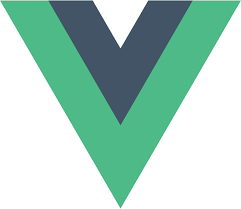
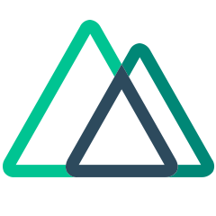

### Welcome here! 👋

---

### I'm Florent

I'm French 🇫🇷 but I live in Barcelona, Spain 🇪🇸.  
I graduated from the ESIR engineering school in Computer Sciences.

I speak about my developer journey on Twitter too [#kapcash](https://twitter.com/Kapcash)

### My work

I'm a Vuejs developer.

And I mainly use the Nuxt framework to build apps.

The work I am most proud of: (aka. the only personal projects I managed to release)
* [bookmark-switcher](https://github.com/Kapcash/bookmark-switcher): A browser extension built with Vue 3 to provide multiple bookmark bars
* [vue-class-transformer](https://github.com/Kapcash/vue-class-transformer): A CLI that transforms vanilla Vuejs components to Typescript class based components
* [vue-spin-wheel](https://github.com/Kapcash/vue-spin-wheel): A renderless wheel component that moves on user interactions

### My Github stats

